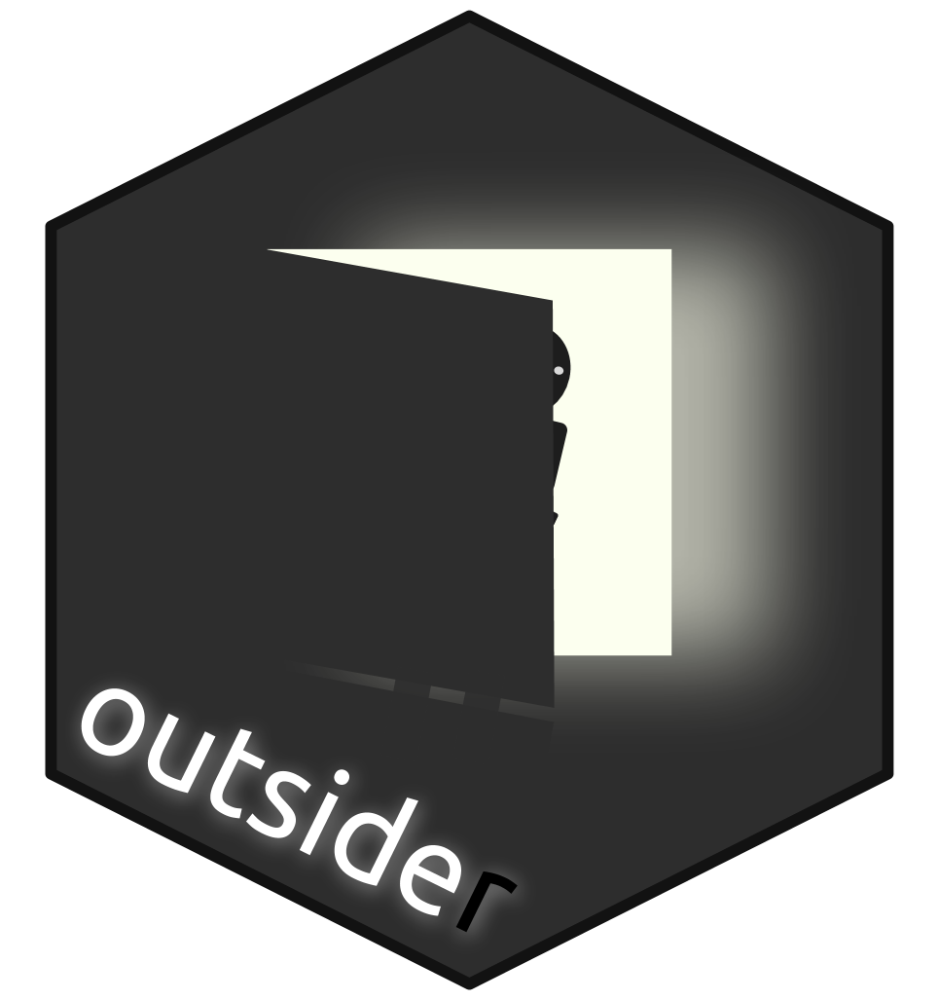

<!-- README.md is generated from README.Rmd. Please edit that file -->
<!-- devtools::rmarkdown::render("README.Rmd") -->
<!-- Rscript -e "library(knitr); knit('README.Rmd')" -->
Install and run programs, outside of R, inside of R 
====================================================================================================

[](https://travis-ci.org/AntonelliLab/outsider) [](https://coveralls.io/github/AntonelliLab/outsider?branch=master) [](https://www.repostatus.org/#active) [](https://zenodo.org/badge/latestdoi/145114547) [](https://github.com/ropensci/onboarding/issues/282)

> The Outsider is always unhappy, but he is an agent that ensures the happiness for millions of 'Insiders'.<br><br> *[The Outsider, Wilson, 1956](https://en.wikipedia.org/wiki/The_Outsider_(Colin_Wilson)).*

<br> Integrating external programs into a deployable, R workflow can be challenging. Although there are many useful functions and packages (e.g. `base::system()`) for calling code and software from alternative languages, these approaches require users to independently install dependant software and may not work across platforms. `outsider` aims to make this easier by allowing users to install, run and control programs *outside of R* across all operating systems.

**For more detailed information, check out the [`outsider` website](https://antonellilab.github.io/outsider/articles/outsider.html)**

Installation
------------

To install the development version of the package ...

``` r
devtools::install_github('AntonelliLab/outsider')
```

Additionally, you will also need to install **Docker desktop**. To install Docker visit the Docker website and follow the instructions for your operating system: [Install Docker](https://www.docker.com/products/docker-desktop).

Quick example
-------------

``` r
library(outsider)
# outsider modules are hosted on GitHub and other code-sharing sites
# this repo is a demonstration outsider module
# it contains a function for printing 'Hello World!' in Ubuntu 18.04
repo <- 'dombennett/om..hello.world'
module_install(repo = repo, force = TRUE)
# look up the help files for the module
module_help(repo = repo)
# import the 'hello_world' function
hello_world <- module_import(fname = 'hello_world', repo = repo)
# run the imported function
hello_world()
#> Hello world!
#> ------------
#> DISTRIB_ID=Ubuntu
#> DISTRIB_RELEASE=18.04
#> DISTRIB_CODENAME=bionic
#> DISTRIB_DESCRIPTION="Ubuntu 18.04.1 LTS"
```

Available external programs
---------------------------

    #> Warning in FUN(X[[i]], ...): Unable to fetch data from GitHub for
    #> 'DomBennett/om..mafft'
    #> Warning in FUN(X[[i]], ...): Unable to fetch data from GitHub for
    #> 'DomBennett/om..revbayes'
    #> Warning in FUN(X[[i]], ...): Unable to fetch data from GitHub for
    #> 'DomBennett/om..pyrate'
    #> Warning in FUN(X[[i]], ...): Unable to fetch data from GitHub for
    #> 'DomBennett/om..raxml'
    #> Warning in FUN(X[[i]], ...): Unable to fetch data from GitHub for
    #> 'DomBennett/om..bamm'
    #> Warning in FUN(X[[i]], ...): Unable to fetch data from GitHub for
    #> 'DomBennett/om..blast'
    #> Warning in FUN(X[[i]], ...): Unable to fetch data from GitHub for
    #> 'DomBennett/om..beast'
    #> Warning in FUN(X[[i]], ...): Unable to fetch data from GitHub for
    #> 'DomBennett/om..astral'
    #> Warning in FUN(X[[i]], ...): Unable to fetch data from GitHub for
    #> 'DomBennett/om..hello.world'

Modules available on GitHub since 14:24 09 May 2019 (CEST)

● astral

● BAMM

● beast

● blast

● hello world

● mafft

● PyRate

● RAxML

● revbayes

For more details, see the [available modules table](https://antonellilab.github.io/outsider/articles/available.html)

How does it work?
-----------------

`outsider` makes use of the program [docker](https://www.docker.com/) which allows users to create small, deployable virtual machines, called Docker images. The advantage of these images is that they can be run on any machine that has Docker installed, regardless of operating system. The `outsider` package makes external programs available in R by facilitating the interaction between Docker and the R console through **outsider modules**. These modules consist of two parts: a Dockerfile that describes the Docker image that contains the external program and an R package for interacting with the Docker image. Upon installing and running a module through `outsider`, a Docker image is launched and the R code of the module is used to interact with the external program. Anyone can create a module. They are hosted on [GitHub](https://github.com/) as well as other code-sharing sites and can be searched for and downloaded through `outsider`.


Version
-------

Development version 0.

Maintainer
----------

[Dom Bennett](https://github.com/DomBennett)
