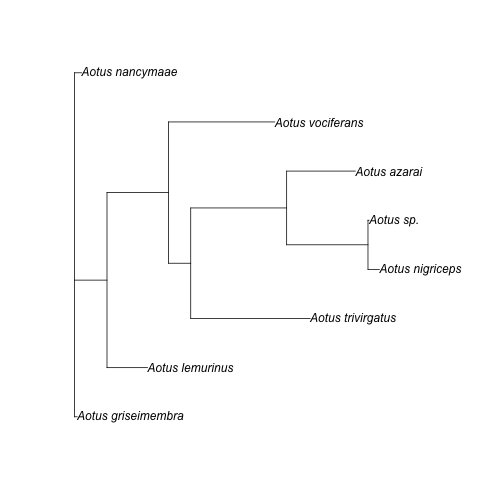

The whole point of `outsider` is to bring lots of programs together into a
single place to allow the development of analysis pipelines. Let's demonstrate
this process by creating a simple pipeline for constructing an evolutionary
tree. We will generate a tree in three steps: obtain orthologous DNA sequences,
align these sequences and then estimate a tree.

In our example, we will keep it simple and fast and generate a tree of
[CytB](https://en.wikipedia.org/wiki/Cytochrome_b) sequences in the primate
genus of Night Monkeys, **Aotus**.

# phylotaR

To get us started we need DNA sequences that represent the same gene region,
i.e. sequences that are orthologous. We can obtain our sequences quickly using
the example data from the R package
[`phylotaR`](https://github.com/ropensci/phylotaR).

```r
# phylotaR is currently not avaialble on CRAN but can be install from Github
remotes::install_github("ropensci/phylotaR")
```

`phylotaR` provides a pipeline for identifying orthologous sequences from a
reputable online biological sequence database. The package comes with a few
pre-calculated example sequences. We can extract sequence clusters that
represent the gene region [cytb](https://en.wikipedia.org/wiki/Cytochrome_b)
with the following script.


```r
aotus <- NULL
```

```r
library(phylotaR)
# Example data
data("aotus")
# Generate summary of identified clusters
smmry <- summary(aotus)
# Extract cluster with 'cytb' in feature name
cytb <- smmry$ID[which(grepl('cytb', smmry$Feature))[1]]
cytb <- drop_clstrs(aotus, cytb)
# Reduce cluster to just one sequence per taxon
cytb <- drop_by_rank(cytb, n = 1)
# Get taxonomic IDs for taxa in cluster
txids <- get_txids(cytb, cid = cytb@cids[[1]])
# Convert IDs to species names
sp_nms <- get_tx_slot(cytb, txids, slt_nm = 'scnm')
sp_nms <- sub(' ', '_', sp_nms)
# Write out
write_sqs(cytb, 'aotus_cytb.fasta', sq_nm = sp_nms, sid = names(sp_nms))
# What do the first 50 lines of the file look like?
cat(paste0(readLines('aotus_cytb.fasta', n = 50), collapse = '\n'))
```

```
## >Aotus_nancymaae
## atgacttctccccgcaaaacacacccactaacaaagatcattaacgaatcattcattgatctacccacaccacccaacat
## ttcctcctgatgaaattttggctcactcttaggcatttgcctaattattcaaatcaccaccggcctgttcttagctatac
## actacacaccagatacctcaaccgccttctcctccgtcgcccatatcacccgagacgtcaactatggctgaataattcgc
## tacatacatgccaacggtgcttccatattcttcgtatgcctttttctccacattggtcgaggactttactatggatcctt
## tctttctctgaagacttgaaatatcggtaccatcctactacttacaaccatagccacagcattcataggctatgttcttc
## catgaggccaaatatcattctgaggggctacagtaattacaaatcttttatcagccattccctatatcggatctgacctt
## gtacaatgaatttgaggtggcttctcagtagataaagccactctcacacgattctttacttttcactttatcttaccctt
## cattatcgcagccctagcaactatccatctattatttctgcatgaaacaggatcaagtaacccatcaggaataacatctg
## accccgacaaaatcacatttcacccctattatacagctaaagacattctaggattaatctttcttctcttatccctaata
## agcctaaccctatttatacccgaccttttaaccgacccagataattatacactggctaatcccctcaacactccacccca
## catcaagccagagtgatattttctatttgcatacgcaatcctacgatctatccctaataaacttggaggagttctagccc
## tagtactttctattttaattctaatagttatccctatactacatctctccaaacaacaaagcataatatttcgacccatc
## actcaaattctattctgaactctagtagctgacctactaactctcacatgaattggaggccaaccggttgaatacccctt
## cgtaaccattggccaaaccgcatccattacatacttcttcattattattatcctaatgcccctttccgcctcaatcgaaa
## atatattacttaaatgataa
## 
## >Aotus_azarai
## atgacctccccccgcaaaacacacccactagcaaagattattaacgaatcattcatcgatctccccacaccatccaacat
## ttcctcttgatgaaattttggctcactcttaggcatttgcctaatcattcaaatcaccaccggcctgttcttagctatac
## attacacaccagatacctcaactgccttctcctccgtcgctcatatcacccgagacgttaactatggctgaataattcgc
## tatatacatgccaacggcgcttccatattcttcgtatgcctttttctccatattggccgaggactttactatggatcttt
## cctttttctgaagacttgaaatatcggtattatcctactacttacaaccatagccacagcattcataggctatgttcttc
## catgaggccaaatatcattctgaggggccacagtaattacaaaccttctatcagctatcccctatatcgggtctgacctt
## gtacaatgaatttgaggtggcttctcagtagataaagccactctcacacgattctttacttttcactttatcttaccctt
## tattatcgcagccctagcaactattcacctcttatttctacatgaaacaggatcaagcaacccatcaggaataacatctg
## accccgacaaagtcacattccacccctattatacagctaaggatattctaggattaatctttcttctcttatccctaata
## agcctaaccctatttatacccgaccttctaacggacccagataattatacactagccaaccctctcaacaccccgcctca
## cattaagccagagtggtattttctatttgcatacgcaattctacgatctatccctaataaacttggaggagtactagccc
## tagtactttctatcctaatcttaatggctatccccgtactacatttctccaaacagcaaagtataatatttcgacccatt
## actcaaattctattctgagctctggtagctgacctactaactctcacgtgaattggaggtcaaccagttgagtacccctt
## cgtaaccattggccagaccgcatccattatatacttcttcattattattaccctaataccccttttcgccttaattgaaa
## ataaattacttaaatgatag
## 
## >Aotus_griseimembra
## atgacttctccccgcaaaacacacccactaacaaagatcattaacgaatcattcattgatctacccacaccacccaacat
## ttcctcctgatgaaattttggctcactcttaggcatttgcctaattattcaaatcaccaccggcctgttcttagctatac
## actacacaccagatacctcaaccgccttctcctccgtcgcccatatcacccgagacgtcaactatggctgaataattcgc
## tacatacatgccaacggtgcttccatattcttcgtatgcctttttctccacattggtcgaggactttactatggatcctt
## cctttctctgaagacttgaaatatcggtaccatcctactacttacaaccatagccacagcattcataggctatgttcttc
## catgaggccaaatatcattctgaggggctacagtaattacaaatcttatatcagccattccctatatcggatctgacctt
## gtacaatgaatttgaggtggcttctcagtagataaagccactctcacacgattctttacttttcactttatcttaccctt
## cattatcgcagccctagcaactatccatctattatttctgcatgaaacaggatcaagtaacccatcaggaataacatctg
## accccgacaaaatcacatttcacccctattatacagctaaagacattctagggttaatctttcttctcttatccctaata
## agcctaaccctatttatacccgaccttttaaccgacccagataattatacactggctaatcccctcaacactccacccca
## catcaagccagagtgatattttctatttgcatacgcaattctacgatctatccctaataaacttggaggagttctagccc
## tagtactttctattttaattctaatagttatccctatactacatctctccaaacaacaaagcataatatttcgacccatc
## actcaaattctattctgaactctagtagctgacctactaactctcacatgaattggaggccaaccggttgaatacccctt
## cgtaaccattggccaaaccgcatccattacatacttcttcattattattatcctaatgcccctttccgcctcaatcgaaa
## atatattacttaaatgataa
```

```r
cat('...')
```

```
## ...
```

# Alignment

Now we have written our sequences to a text-based `.fasta` file, we need to
align them! To do this, we can use
[`mafft`](https://mafft.cbrc.jp/alignment/software/). We first need to install
the module and then import the key function, `mafft`. After doing this, we can
call the `mafft` program using the same arguments that we would if it were
calling the program via command-line. For simplicity, we can run our alignment
using the '--auto' parameter.


```r
library(outsider)
```

```
## ----------------
## outsider v 0.1.0
## ----------------
## - Security notice: be sure of which modules you install
```

```r
# Install module
repo <- 'dombennett/om..mafft'
module_install(repo = repo, force = TRUE)
```

```r
# Import the function
mafft <- module_import(fname = 'mafft', repo = repo)
# Run our program with normal mafft arguments
# Note: all arguments must be separate character variables.
mafft(arglist = c('--auto', 'aotus_cytb.fasta', '>', 'alignment.fasta'))
```

```
## outputhat23=16
## treein = 0
## compacttree = 0
## stacksize: 8192 kb
## generating a scoring matrix for nucleotide (dist=200) ... done
## All-to-all alignment.
##     0 / 8

-
    1 / 8

|
    2 / 8

-
    3 / 8

|
    4 / 8

-
    5 / 8

|
    6 / 8

-
tbfast-pair (nuc) Version 7.407
## alg=L, model=DNA200 (2), 2.00 (6.00), -0.10 (-0.30), noshift, amax=0.0
## 0 thread(s)
## 
## outputhat23=16
## Loading 'hat3.seed' ... 
## done.
## 
|
Writing hat3 for iterative refinement
## generating a scoring matrix for nucleotide (dist=200) ... done
## Gap Penalty = -1.53, +0.00, +0.00
## tbutree = 1, compacttree = 0
## Constructing a UPGMA tree ... 
## 
    0 / 8
## done.
## 
## 
-
Progressive alignment ... 
## 
STEP     1 /7 
|

STEP     2 /7 
-

STEP     3 /7 
|

STEP     4 /7 
-

STEP     5 /7 
|

STEP     6 /7 
-

STEP     7 /7 
|
## done.
## tbfast (nuc) Version 7.407
## alg=A, model=DNA200 (2), 1.53 (4.59), -0.00 (-0.00), noshift, amax=0.0
## 1 thread(s)
## 
## 
-
minimumweight = 0.000010
## autosubalignment = 0.000000
## nthread = 0
## randomseed = 0
## blosum 62 / kimura 200
## poffset = 0
## niter = 16
## sueff_global = 0.100000
## nadd = 16
## 
|
Loading 'hat3' ... done.
## generating a scoring matrix for nucleotide (dist=200) ... done
## 
-
## 
    0 / 8
## Segment   1/  1    1-1141
## 
|
STEP 001-001-0 
-
 identical.   
STEP 001-001-1 
|
 identical.   
STEP 001-002-0 
-
 identical.   
STEP 001-002-1 
|
 identical.   
STEP 001-003-0 
-
 identical.   
STEP 001-003-1 
|
 identical.   
STEP 001-004-0 
-
 identical.   
STEP 001-004-1 
|
 identical.   
STEP 001-005-0 
-
 identical.   
STEP 001-005-1 
|
 identical.   
STEP 001-006-0 
-
 identical.   
STEP 001-006-1 
|
 identical.   
STEP 001-007-1 
-
 identical.   
STEP 002-007-1 
|
 identical.   
STEP 002-006-0 
-
 identical.   
STEP 002-006-1 
|
 identical.   
## Converged.
## 
## done
## 
-
dvtditr (nuc) Version 7.407
## alg=A, model=DNA200 (2), 1.53 (4.59), -0.00 (-0.00), noshift, amax=0.0
## 0 thread(s)
## 
## 
|
## Strategy:
##  L-INS-i (Probably most accurate, very slow)
##  Iterative refinement method (<16) with LOCAL pairwise alignment information
## 
## If unsure which option to use, try 'mafft --auto input > output'.
## For more information, see 'mafft --help', 'mafft --man' and the mafft page.
## 
## The default gap scoring scheme has been changed in version 7.110 (2013 Oct).
## It tends to insert more gaps into gap-rich regions than previous versions.
## To disable this change, add the --leavegappyregion option.
## 
## 
```

# Phylogeny

We can repeat the same process as we did for `mafft` but instead for
[`RAxML`](https://github.com/stamatak/standard-RAxML) -- a command-line program
for estimating evolutionary trees from an alignment of DNA sequences using a
model of molecular evolution (GTRGAMMA) with maximum likelihood.


```r
library(outsider)
# Install
repo <- 'dombennett/om..raxml'
module_install(repo = repo, force = TRUE)
```

```r
# Import
raxml <- module_import(fname = 'raxml', repo = repo)
# Run
raxml(arglist = c('-m', 'GTRGAMMA', '-s', 'alignment.fasta', '-p', '1234',
                  '-n', 'aotus_cytb', '-T', '2'))
```

```
##
## RAxML can't, parse the alignment file as phylip file 
## it will now try to parse it as FASTA file
## 
## 
## 
## Using BFGS method to optimize GTR rate parameters, to disable this specify "--no-bfgs" 
## 
## 
## This is the RAxML Master Pthread
## 
## This is RAxML Worker Pthread Number: 1
## 
## 
## This is RAxML version 8.2.12 released by Alexandros Stamatakis on May 2018.
## 
## With greatly appreciated code contributions by:
## Andre Aberer      (HITS)
## Simon Berger      (HITS)
## Alexey Kozlov     (HITS)
## Kassian Kobert    (HITS)
## David Dao         (KIT and HITS)
## Sarah Lutteropp   (KIT and HITS)
## Nick Pattengale   (Sandia)
## Wayne Pfeiffer    (SDSC)
## Akifumi S. Tanabe (NRIFS)
## Charlie Taylor    (UF)
## 
## 
## Alignment has 74 distinct alignment patterns
## 
## Proportion of gaps and completely undetermined characters in this alignment: 0.00%
## 
## RAxML rapid hill-climbing mode
## 
## Using 1 distinct models/data partitions with joint branch length optimization
## 
## 
## Executing 1 inferences on the original alignment using 1 distinct randomized MP trees
## 
## All free model parameters will be estimated by RAxML
## GAMMA model of rate heterogeneity, ML estimate of alpha-parameter
## 
## GAMMA Model parameters will be estimated up to an accuracy of 0.1000000000 Log Likelihood units
## 
## Partition: 0
## Alignment Patterns: 74
## Name: No Name Provided
## DataType: DNA
## Substitution Matrix: GTR
## 
## 
## 
## 
## RAxML was called as follows:
## 
## raxmlHPC-PTHREADS-SSE3 -m GTRGAMMA -s alignment.fasta -p 1234 -n aotus_cytb -T 2 
## 
## 
## Partition: 0 with name: No Name Provided
## Base frequencies: 0.289 0.285 0.120 0.306 
## 
## Inference[0]: Time 0.056735 GAMMA-based likelihood -2591.962827, best rearrangement setting 5
## 
## 
## Conducting final model optimizations on all 1 trees under GAMMA-based models ....
## 
## Inference[0] final GAMMA-based Likelihood: -2591.962819 tree written to file /working_dir/RAxML_result.aotus_cytb
## 
## 
## Starting final GAMMA-based thorough Optimization on tree 0 likelihood -2591.962819 .... 
## 
## Final GAMMA-based Score of best tree -2591.962819
## 
## Program execution info written to /working_dir/RAxML_info.
-
aotus_cytb
## Best-scoring ML tree written to: /working_dir/RAxML_bestTree.aotus_cytb
## 
## Overall execution time: 0.095162 secs or 0.000026 hours or 0.000001 days
## 
## 
```

# Visualisation

Now, let's check out our tree! We can use the R package
["Analysis of Phylogenetics and Evolution" or `ape`](http://ape-package.ird.fr/)
to do this.


```r
library(ape)
tree <- read.tree('RAxML_bestTree.aotus_cytb')
plot(tree)
```




